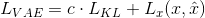
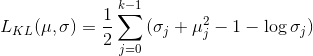
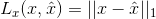
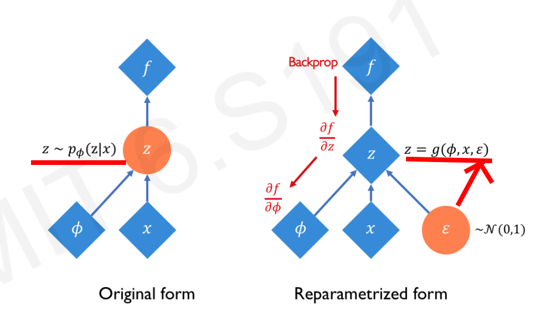

# Generative Modelling

Unsupervised learning
latent variable 潜在变量 != observable variable

## Autoencoders

a bottle neck layer network

- raw data ====> **low dimensional latent space** ===> reconstruct

- why low Dimension, compressed

- do not have training data (unsupervised training)

- solution: code a decoder to see whether decoded (ŷ) same with raw data (y)

- goal: to be as realistic by calculating loss function (reconstruction loss)

        L = (y-ŷ)^2

# Variational Autoencoders (VAEs) solution

- stochastic node

- add a mean (u) and standard deviation

- add a probability distributions

- regularization term = de-sensitivation

1.  VAE loss = Reconcstruction + KL Divergence (Latent Loss)



```python
def vae_loss_function(x, x_recon, mu, logsigma, kl_weight=0.0005):

vae_loss = kl_weight * latent_loss + reconstruction_loss
```

2. Latent loss =



```python
latent_loss = 0.5 * tf.reduce_sum(tf.exp(logsigma) + tf.square(mu) - 1.0 - logsigma, axis=1)
```

3. Reconsctruction loss =



```python
reconstruction_loss = tf.reduce_mean(tf.abs(x-x_recon), axis=(1,2,3))
```

- prevent overfit

- **<ins>Problem A<ins>** : cannot backprop because latent vector is stochastic

## Reparametrizing sampling layer trick

**solution for problem A**: fix cannot backprop

- add one epsillon (fixed stochastic 随机 node)

                z = mean + standard Deviation \* epsillon



# Debiasing variational autoencoder

- add a little supervision

- to reduce bias by:

1. increasing the sampling probability of infrequent sample
2. decreate over-represented samples

## How

- add one more loss function VaeLoss + Classification loss
  > > Classification Loss = cross-entropy loss for a binary classification

1. if no face is detected, loss function - classification loss

# Generative Adversarial Networks(GANs)

Goal: generate fake data from noise

## concept

1. generator: noise -> fake data

2. discriminiator: identify fake data

3. train discriminator and estimates probability of real data

4. generator see real examples and generate data

5. repeat until generator can fake discriminator

### CycleGan

transform video, voice
