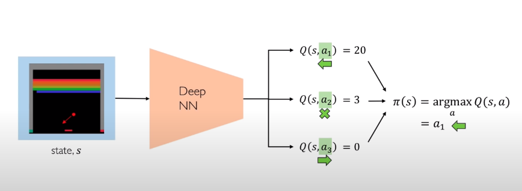

# Reinforced Learning

- Data are in state/action pairs
- Goal: maximise rewards
- example: agent eat a apple to gain lifes

## Key concepts

1. Agent do some **action** to the environment
2. environment provides **observations**<u>(state)</u> back to agent
3. repeat step 1,2
4. goal of agent to get reward, not necessarily rewarded immediately

### Rewards

Total Reward (return) = reward(t) + reward(t+1) + reward(t+n)

- discounted so that agent chooses most present rewards
- reward is lesser more into the future

### Q-function

- to know that whether that particular action in the state is maximising the reward

#### Strategy

- enter all states, and check which q-value is highest -> then execute

- Strategy: choose higher value action

## Algorithim

### Value Learning

- Get Q function and infer best policy

#### Deep Q Network(DQN)

- argmax q value to determine which policy

- good for atari games

- limited to discrete action space

##### Downside

1. if action space too big / infinite

2. only for finite small possible actions

3. cannot learn stochastic policies

### Policy Learning

- directly learn policy

- output a probability of "taking an action gives highest q-value"

- "90% confirm that you should go left"

- Can used in conitnious action space

#### Advantages

- remove the contrain of classification

### Action Space

|             Discrete             |        Continuous         |
| :------------------------------: | :-----------------------: |
| "which direction should i move?" | "how fast should i move?" |
|          output q-value          |  output (mean, variance)  |
